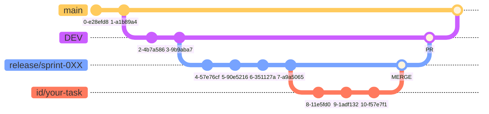

# Template Frontend - v1

<p align="center">
  
</p>

## Sobre o template:
- Pré-Estrutura de pastas;
- Diversos componentes úteis e páginas básicas de uma aplicação;
- Padronização do código e bibliotecas;
- Facilitação na organização dos projetos em ReactJS;
- Internacionalização (Português / Inglês / Espanhol);
- Temas: Claro (Light) / Escuro (Dark);
- Inputs com máscaras (CPF, CNPJ, CEP, Telefone, etc);
  
## Principais Tecnologias
- ReactJS;
- Vite;
- TypeScript;

## Bibliotecas Padrões Instaladas
- Axios (requisições HTTP);
- TailwindCSS (Estilizações); 
- Ant Design (Componentes UI);
- React Google Charts (Criação de gráficos); 
- Antd mask input (Input com máscaras - CPF, CNPJ, Data, Telefone e etc);
- React Currency Mask (Input com máscara de valor monetário);
- Lucide React (Icones);
- i18next React (Internacionalização);

## Como rodar o projeto

Antes de começar, certifique-se de ter o Node.js e o Yarn instalados na sua máquina.

1. Clone o Repositório
```
git clone git@github.com:fairy-projects/template_frontend_v1.git
```

2. Instale as dependências

```
yarn install
```

3. Rode o Servidor de Desenvolvimento

```
yarn dev
```
Após executar esses comandos, o projeto estará rodando localmente. Você pode acessá-lo em http://localhost:5173 no seu navegador.


## Branches e Fluxo de Trabalho
Para maiores detalhes, consulte a [documentação](https://www.notion.so/fairy-solutions/Git-GitHub-GitFlow-dd6ea3d0bcd04f2490b76cf2b96a520a) sobre o fluxo de trabalho utilizado pelo time de desenvolvimento.



